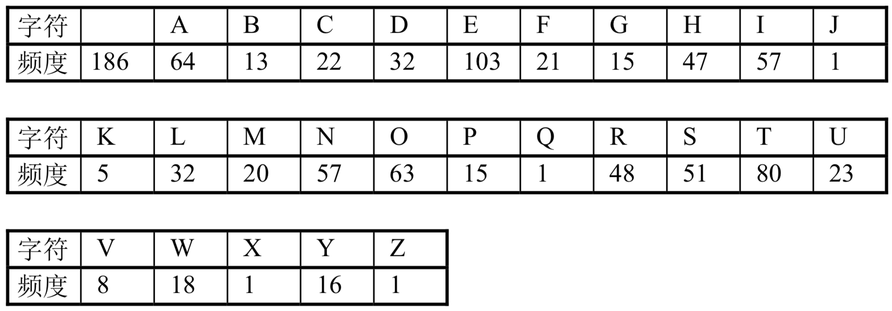

<!--
 * @Author: hiddenSharp429 z404878860@163.com
 * @Date: 2024-11-04 18:35:53
 * @LastEditors: hiddenSharp429 z404878860@163.com
 * @LastEditTime: 2024-11-17 00:47:57
-->
# DS

This is a course assignment repository for the Shantou University compulsory course "Data Structure"! Hope it can help you!

这是一个用于存放学校必修课程《数据结构》中课程作业的仓库，仅是个人思路，并且仅供参考，可用于学习交流，请勿用于其他用途。

This repository is divided into two parts: projects and assignments.

这个课程需要完成的任务分为项目和作业两个部分:

The following are the task descriptions for each assignment:

# Assignment
以下是各作业的要求以及存放答案的文件夹路径。

## Assignment 1
<details>

<summary>回答以下问题并且提交相关文件</summary>


1. 简述下列概念：数据、数据元素、数据项、数据对象、数据结构、逻辑结构、存储结构、抽象数据类型。
2. 以Niklus Wirth的观点，程序是什么? 
3. 算法有什么特性？
4. 好算法应满足哪些标准？
5. 数据结构主要在哪些层面上讨论问题？
6. 分析下列算法的时间复杂度。
```
(1)
for(i=0;i<n;i++)
    for(j=0;j<m;j++)
        a[i][j]=0;

(2)
s=0;
for(i＝0; i＜n;i++)
    for(j＝0;j<n;j++)
        s+＝B[i][j]
sum=s;

(3)
i=1；
while(i<=n)
i=i*3;

(4)x=0;
for(i＝1;i＜n;i++)
    for(j＝1;j<＝n-1;j++)      
        x++;
```
</details>

> 存放该作业文件夹：`assignment/assignment1`

## Assignment 2
<details>
<summary>完成以下任务并且提交相关文件。</summary>

1. 已知长度为n的线性表A采用顺序存储结构，请写一时间复杂度为O(n)、空间复杂度为O(1)的算法，该算法删除线性表中所有值为item的数据元素。
</details>

> 存放该作业文件夹：`assignment/assignment2`


## Assignment 3
<details>
<summary>完成以下任务并且提交相关文件。</summary>

1. 写一算法，对单链表实现就地逆置
2. 定义静态链表的存储结构；写出不带头结点静态链表的插入和删除算法。
3. 有一个双链表L，其中有n(n>=1)个值不相同的数据节点，设计一个算法删除最大值的结点。
</details>

> 存放该作业文件夹：`assignment/assignment3`


## Assignment 4
<details>
<summary>完成以下任务并且提交相关文件。</summary>

1. 
   1. 写出运行下列程序段的输出结果(元素类型为char)
    ```
    void main() {
        Stack S; 
        char x,y; 
        InitStack(S); // 初始化栈
        x= ‘e ‘; 
        y= ‘c’; 
        Push(S, ‘h‘); 
        Push(S, ‘r‘);  
        Push(S,y);
        Pop(S,x); 
        Push(S, x); 
        Pop(S,x); 
        Push(S,’a’); 
        While (!SEmpty(S)) {
            Pop(S,y); 
            printf(y); 
        }; 
        printf(x); 
    }
    ```
   2. 如果想要输出的结果是： c h a r ，怎么改这段程序？
2. 写出运行下列程序段的输出结果(元素类型为char)
```
void main() {
    Queue S; 
    char x,y; 
    InitQueue(S); // 初始化栈
    x= ‘e ‘; 
    y= ‘c’; 
    EnQueue(S, ‘h‘); EnQueue(S, ‘r‘); EnQueue(S,y);
    DeQueue(S,x); EnQueue(S, x); 
    DeQueue(S,x); EnQueue(S,’a’); 
    While (!SEmpty(S)) {
        DeQueue(S,y); printf(y); 
    }; 
    printf(x); 
}
```
- 3、算法设计：假设以带头结点的循环链表表示队列，并且只设一个指针指向队尾元素结点(注意不设头指针) ，试编写相应的置空队、判队空 、入队和出队等算法。
- 4、回文是指正读反读均相同的字符序列，如“abba”和“abdba”均是回文，但“good”不是回文。试写一个算法判定给定的字符向量是否为回文。(提示：将一半字符入栈)
</details>

> 存放该作业文件夹：`assignment/assignment4`

## Assignment 5
<details>
<summary>完成以下任务并且提交相关文件。</summary>

1. 自学第四章，以思维导图的形式总结第四章的内容。
</details>

> 存放该作业文件夹：`assignment/assignment5`

## Assignment 6
<details>
<summary>完成以下任务并且提交相关文件。</summary>

1. 设计一个算法,将含有n个元素的整数数组A[0…n-1]的元素循环右移1≤m<n)位。要求算法的空间复杂度为O(1)。
2. 完成用十字链表存储的稀疏矩阵的加法运算。
</details>

> 存放该作业文件夹：`assignment/assignment6`

## Assignment7
<details>
<summary>完成以下任务并且提交相关文件。</summary>

1. 知一棵树边的集合为{<I,M>,<I,N>,<E,I>,<B,E>,<B,D>,<A,B>,<G,J>, <G,K>,<C,G>,<C,F>,<H,L>,<C,H>,<A,C>},请画出这棵树，并回答下列问题：
   1. 哪个是根结点？
   2. 哪些是叶子结点？
   3. 哪个是结点G的双亲？
   4. 哪些是结点G的祖先？
   5. 哪些是结点G的孩子？
   6. 哪些是结点E的子孙？
   7. 哪些是结点E的兄弟？哪些是结点F的兄弟？
   8. 结点B和N的层次号分别是什么？
   9. 树的深度是多少？
   10. 以结点C为根的子树的深度是多少？
2. 一棵度为2的树与一棵二叉树有何区别？
3. 已知一棵度为k的树中有n1个度为1的结点，n2个度为2的结点，…，nk个度为k的结点，问该树中有多少个叶子结点？
4. 已知一棵含有n个结点的树中，只有度为k的分支结点和度为0的叶子结点，求该树含有的叶子结点的数目
5. 证明：一棵满k叉树上的叶子结点数n0和非叶子结点数n1之间满足下列关系：$n0=（k-1）n1+1$
</details>

> 存放该作业文件夹：`assignment/assignment7`

## Assignment 8
<details>
<summary>完成以下任务并且提交相关文件。</summary>

1. 用按层次顺序遍历二叉树的方法，统计树中具有度为1的结点数目。
2. 求任意二叉树中第一条最长的路径长度，并输出此路径上各结点的值。
3. 输出二叉树中从每个叶子结点到根结点的路径。
4. 讲下列二叉链表改为先序线索链表（不用画树）


</details>

> 存放该作业文件夹：`assignment/assignment8`

## Assignment 9
<details>
<summary>完成以下任务并且提交相关文件。</summary>

1. 设一棵二叉树的先序序列： A B D F C E G H ，中序序列： B F D A G E H C
   1. 画出这棵二叉树。
   2. 画出这棵二叉树的后序线索树。
   3. 将这棵二叉树转换成对应的树（或森林）
2. 假设一棵非空树采用孩子链存储结构,每个结点值均为单个字符,完成以下任务：
   1. 设计一个算法求树t中的叶子结点个数。
   2. 设计一个算法求树t中度为k的结点个数。
3. 设用于通讯的电文由八个字母组成, 字母在电文中出现的频率分别为: 8, 10, 5, 19, 30, 15, 11, 28。试为这八个字母设计哈夫曼编码。   
</details>

> 存放该作业文件夹：`assignment/assignment9`

## Assignment 10
<details>
<summary>完成以下任务并且提交相关文件。</summary>

1. 假设不带权有向图G采用邻接表存储,分别设计实现求解以下问题的算法。
   1. 求出图G中每个顶点的入度。
   2. 求出图G中每个顶点的出度。
   3. 求出图G中出度最大的一个顶点,输出该顶点编号。
   4. 计算图G中出度为0的顶点数。
   5. 判断图G中是否存在边<i,j>。
2. 分别以邻接矩阵和邻接表作为存储结构，实现以下图的基本操作：
   1. 增加一个新顶点v，InsertVex(G, v)；
   2. 删除顶点v及其相关的边，DeleteVex(G, v);
   3. 增加一条边<v，w>，InsertArc(G, v, w);
   4. 删除一条边<v，w>，DeleteArc(G, v, w)。
3. 已知如右图所示的有向图，请给出该图的
   1. 每个顶点的入/出度；
   2. 邻接矩阵；
   3. 邻接表；
   4. 逆邻接表；
   5. 强连通分量
   
   
</details>

> 存放该作业文件夹：`assignment/assignment10`

## Assignment 11
<details>
<summary>完成以下任务并且提交相关文件。</summary>

1. 已知二维数组表示的图的邻接矩阵如下图所示，分别画出自顶点1出发进行遍历所得的深度优先生成树和广度优先生成树。


2. 设计一个算法,判断一个未知顶点个数和边数的无向连通图G是否是棵树,假设图采用邻接表存储。若是树,返回true;否则返回 false.（提示：一个无向连通图G是一棵树的条件是G中无回路或者恰好有n-1条边，可采用后者作为判断条件）
(用图1和图2验证作业题2算法的正确性)


</details>

> 存放该作业文件夹：`assignment/assignment11`

## Assignment 12
<details>
<summary>完成以下任务并且提交相关文件。</summary>

1. 针对下图，
   1. 写出其邻接矩阵，并按Prim算法求其最小生成树
   2. 写出其邻接表，并按Kruskal算法求其最小生成树


2. 针对下图，
   1. 列出全部可能的拓扑有序序列
   2. 写出其邻接表， 并指出应用课上所学的TopLogicalSort算法求得的是哪一个序列


</details>

> 存放该作业文件夹：`assignment/assignment12`

## Assignment 13
<details>
<summary>完成以下任务并且提交相关文件。</summary>

1. 针对下图AOE网络，计算个活动弧的e（ai），l（ai）的值、各事件（顶点）的ve（vi），l（vi）
   


2. 利用Dijkstra算法，求图中顶点a到其他各顶点的最短路径，写出执行算法过程中各步的状态


3. 利用Floyd算法，求图中各对顶点间的最短路径


4. 已知一个有序表的表长为8N，并且表中没有关键字相同的记录。假设按如下所述方法查找一个关键字等于给定值K的记录：先在第8,16,24,…,8K,…,8N个记录中进行顺序查找，或者查找成功，或者由此确定出一个继续进行折半查找的范围。画出描述上述查找过程的判定树，并求等概率查找时查找成功的平均查找长度。
</details>

> 存放该作业文件夹：`assignment/assignment13`

## Assignment 14
<details>
<summary>完成以下任务并且提交相关文件。</summary>

1. 请对长度为10 的表: (22,45,56,12,33,57,88,94,44,11)画出构造平衡二叉树的过程。
2. 假设一棵平衡二叉树的每个结点都标明了平衡因子b，设计一个算法，求平衡二叉树的高度。
3. 设哈希函数H（K）=3 K mod 11，哈希地址空间为0～10，对关键字序列（32，13，49，24，38，21，4，12），按下述两种解决冲突的方法构造哈希表，并分别求出等概率下查找成功时和查找失败时的平均查找长度ASLsucc和ASLunsucc。
   1. 线性探测法；
   2. 链地址法。
</details>

> 存放该作业文件夹：`assignment/assignment14`

## Assignment 15
<details>
<summary>完成以下任务并且提交相关文件。</summary>

1. 以关键码序列(503,087,512,061,908,170,897,275,653,426)为例，手工执行以下排序算法，写出每一趟排序结束时的关键码状态:
   1. 直接插入排序；
   2. 希尔排序(增量d[1]=5)；
   3. 快速排序；
   4. 堆排序
2. 算法设计：
   有n个记录存储在带头结点的双向链表中，现用双向冒泡排序法对其按上升序进行排序，请写出这种排序的算法。（注：双向冒泡排序即相邻两趟排序向相反方向冒泡）。
3. 判断以下序列是否是最小堆？如果不是，将它调整为最小堆。
   1. {100,86,48,73,35,39,42,57,66,21}
   2. {12,70,33,65,24,56,48,92,86,33}
</details>

> 存放该作业文件夹：`assignment/assignment15`

# Project
以下是各项目的具体要求，以及存放的文件夹路径。

## Project 1
<details>
<summary>完成以下任务并且提交相关文件。</summary>

1. 问题描述
   1. 在“学校运动会管理系统”中，设有n个单位参加运动会（单位可是学院、系、年级等，应可设定）共有男子比赛项目m，女子比赛项目w。 每个学院可以选择参赛项目，运动员参赛项目应有所限制，如最多只能参加3项单项比赛。
   2. 各项目名次选取应可设置，随系统环境而变化，如：参赛人数超过6人，取前5名：第一名得7分，第二名得5分，第三名得3分，第四名得2分，第五名得1分；参赛人数不超过6人，取前3名：第一名得5分，第二名得3分，第三名得2分。参赛人数不足4人的项目将取消等等规定。
   3. 系统设置内容： 
      1. 参赛单位名称； 比赛项目设置（注意比赛成绩排序中田赛和径赛的区别）
      2. 运动员参赛项目限制； 选取名次设置；

2. 系统功能性需求
   1. 参赛项目发布（人为安排时间和场地和项目名字）
   2. 运动员报名登记。登记限制要求按问题描述的要求；（最多报两个项目、前后不应有项目、男女项目不互通）
   3. 参赛信息查询。查看参赛学院信息和比赛项目信息；
   4. 秩序册自动生成；需满足条件，如：
      1. 竞赛项目避免场地冲突；
      2. 同一个运动员参加的不同比赛项目不应有时间上的交叉；
      3. 一个运动员应尽可能避免参加2个连续项目；运动会总时间应该尽可能短；
      4. 运动会上午和下午比赛项目数应较为平均；
      5. 比赛已结束就不能在报名、修改运动员信息了（成绩录入即为比赛结束）
   5. 比赛成绩查询（没有录入成绩的项目成绩为无）。可以按比赛项目（排名）、参赛学院（不排只列学院、名成绩）、参赛运动员（学院、项目、名字、成绩）查看比赛成绩；如：
        ```
        100米：
            第一名  张三    11＇＇2
            第二名  李四    11＇＇7
            第三名  王五    11＇＇9
            第四名  刘六    12＇＇5
            第五名  赵七    12＇＇8
            第六名  周八    13＇＇1
        跳高：
            第一名  张三    2米02
            第二名  李四    2米
            第三名  王五    1米9
            第四名  刘六    1米88
            第五名  赵七    1米82
            第六名  周八    1米8
        ```
   6. 比赛成绩自动统计、分类、汇总；如学院得分、 运动员得分等；
   7. 数据备份。
   8. 前提：报名项目大于3人。成绩录入（输入一个项目后将所有人的成绩一一输入）
> 备注：在秩序册自动生成中应该尽可能采用较为智能的算法。在查询的功能中应进行各种查询算法的性能比较。

</details>

> 存放该作业文件夹：`project/project1`


## Project 2    
<details>
<summary>完成以下任务并且提交相关文件。</summary>

1. 问题描述:</br>
   约瑟夫问题的一种描述是：编号为1,2,...,n的n个人按顺时针方向围坐一圈，每人持有一个密码(正整数)。一开始任选一个正整数作为报数上限值m，从第一个人开始。按顺时针方向自1开始顺序报数，报到m时停止报数。报m的人出列，将他的密码作为新的m值，从他在顺时针方向上的下一个人开始重新从1报数，如此下去，直至所有人全部出列为止。试设计程序求出出列顺序。
2. 基本要求</br>
   利用单向循环链表存储结构模拟此过程，按照出列的顺序印出个人的编号。
3. 测试数据</br>
   m的初值为20;n=7,7个人的密码: 3,1,7,2,4,8,4。(正确的结果应为6,1,4,7,2,3,5) 
   (报告上要求写出多批数据测试结果
4. 实现提示</br>
   程序运行后首先要求用户指定初始报数上限值与人数，然后读取各人的密码。
   提示（跟本实践项目相似）：https://v.qq.com/x/page/f0530h0jyif.html
</details>

> 存放该作业文件夹：`project/project2`

## Project 3
<details>
<summary>完成以下任务并且提交相关文件。</summary>

1. 问题描述</br>
   有一个魔王总是使用自己的一种非常精炼而抽象的语言讲话，没有人能听懂。但他的语言是可以逐步解释成人能懂的语言的，因为他的语言是由以下两种形式的规则由人的语言逐步抽象上去的: 
   1. α→β1...βm
   2. (θδ1...δn) →θδnθδn-1...θδ1θ 在这两种形式中，从左到右均表示解释;从右到左均表示抽象。试写一个魔王语言的解释系统，把他的话解释成人能听得懂的话。 

2. 基本要求</br>
   用下述两条具体规则和上述规则形式(2)实现。设大写字母表示魔王语言解释的词汇，小写字母表示人的语言的词汇；希腊字母表示可以用大写或小写字母代换的变量。魔王语言可含人的词汇。 
   1. Β→ tΑdΑ 
   2. Α→ sae 

3. 测试数据</br>
   B(einxgz)B</br>
   解释成 tsaedsaeezegexeneietsaedsae 若将小写字母与汉字建立下表所示的对应关系，则魔王说的话是：“天上一个鹅地上一个鹅鹅追鹅赶鹅下鹅蛋鹅恨鹅天上一个鹅地上一个鹅。”<br>
   |t	|d	|s	|a	|e	|z	|g	|x	|n	|i|
   |-|-|-|-|-|-|-|-|-|-|
   |天	|地	|上	|一个	|鹅	|追	|赶	|下	|蛋	|恨|

4. 实现提示</br>
   将魔王的语言自右至左进栈，总是处理栈顶。若是开括号，则逐一出栈，将字母顺序入队列，直至闭括号出栈，并按规则要求逐一出队列再处理后入栈。其他情形较简单，请读者思考应如何处理。应首先实现栈和队列的基本运算。
</details>

> 存放该作业文件夹：`project/project3`

## Project 4
<details>
<summary>完成以下任务并且提交相关文件。</summary>

1. 问题描述 </br>
   文学研究人员需要统计某篇英文小说中某些形容词的出现次数和位置。试写一个实现这一目标的文字统计系统，称为"文学研究助手"。

2. 基本要求</br>
   英文小说存于文本文件中。待统计的词汇集合要一次输入完毕，即统计工作必需在程序的一次运行后就全部完成。程序的输出结果是每个词出现次数和出现位置所在行的行号，格式自行设计。
3. 测试数据</br>
   以你的C源程序模拟英文小说，C语言的保留字集作为待统计的词汇集。    

4. 实现提示</br>
   设小说中的词汇一律不跨行。这样每读入一行就统计每个词在这行中的出现次数。出现位置所在行的行号可以用链表存储。若某行中出现不止一次，不必存多个相同的行号。如果希望达到选作部分(1)和(2)所提出的要求，则首先应把KMP(见教科书P86)算法改写成如下的等价形式，再将它推广到多个模式的情形。 
   ```
   do{
    do { 
      j=next[j]; 
    } while (j!=0 && s.ch[i]!=t.ch[j]); 
    j++; 
    i++; //每次进入循环体i只增加一次 
   } while (i!=(s.curlen+1)&&j!=(t.curlen+1)); 
   ```

5. 选作内容</br>
   注意：要在报告中说明选做了哪几部分
   1. 模式匹配要基于KMP算法。
   2. 整个统计过程中只对小说文字扫描一遍以提高效率。
   3. 假设小说中的每个单词或者从行首开始，或者前置以一个空格符。利用单词匹配特点另写一个高效的统计程序，与KMP算法统计程序进行效率比较。
   4. 推广到更一般的模式集匹配问题，并设待查模式串可以跨行。 
   5. 提示: 定义操作getachar)。 
</details>

> 存放该作业文件夹：`project/project4`

## Project 5
<details>
<summary>完成以下任务并且提交相关文件。</summary>

1. 问题描述 </br>
   利用哈夫曼编码进行信息通讯可以大大提高信道利用率，缩短信息传输时间，降低传输成本。但是，这要求在发送端通过一个编码系统对待传数据预先编码；在接收端将传来的数据进行译码(复原)。对于双工信道(即可以双向传输信息的信道)，每端都需要一个完整的编/译码系统。试为这样的信息收发站写一个哈夫曼码的编译码系统。

2. 基本要求</br>
   一个完整的系统应具有以下功能:
   1. I:初始化(Initialization)。从终端读入字符集大小n，及n个字符和n个权值，建立哈夫曼树，并将它存于文件hfmtree中。
   2. C:编码(Coding)。利用已建好的哈夫曼树(如不在内存，则从文件hfmtree中读 入)，对文件tobetrans中的正文进行编码，然后将结果存入codefile中。
   3. D:译码(Decoding)。利用已建好的哈夫曼树将文件codefile中的代码进行译 码，结果存入文件textfile中。
   4. P:印代码文件(Print)。将文件codefile以紧凑格式显示在终端上，每行50个代 码。同时将此字符形式的编码文件写入文件codeprint中。
   5. T:印哈夫曼树(Tree print)。将已在内存中的哈夫曼树以直观的方式 树或凹入表行式)显示在终端上，同时将此字符形式的哈夫曼树写入文件treeprint中。 
3. 测试数据：
   1. 利用教科书6-2中的数据调试程序。 
   2. 用下表中给出的字符集和频度的实际统计数据建立哈夫曼树，并实现以下报文的编码和译码: "THIS PROGRAM IS MY FAVORITE". 

    

4. 实现提示
   1. 文件codefile的基类型可以设为子界型 bit=0..1。
   2. 用户界面可以设计为"菜单"方式: 显示上述功能符号，再加上"E"，表示结束运行End，请用户键入一个选择功能符。此功能执行完毕后再显示此菜单，直至某次用户选择了"E"为止。
   3. 在程序的一次执行过程中，第一次执行I，D或C命令之后，哈符曼树已经在内存了，不必再读入。每次执行中不一定执行I命令，因为文件hfmtree可能早己建好。

5. 选作内容
   1. 上述codefile的基类型实际上占用了存放一个整数的空间，只起到示意或模拟的作用。现使codefile的基类型package=integer，把哈夫曼码紧缩到一个整型变量中去，最大限度地利用码点存储能力，试改写你的系统。 
   2. 修改你的系统，实现对你的系统的源程序的编码和译码。(主要是将行尾符编/译码问题) 
   3. 实现各个转换操作的源/目文件，均由用户在选择此操作时指定。 
    >注：在报告中说明选做了哪些内容
</details>

> 存放该作业文件夹：`project/project5`


## Project 6
<details>
<summary>完成以下任务并且提交相关文件。</summary>

1. 问题描述</br>
   针对某个集体中人名设计一个哈希表，使得平均查找长度不超过R，并完成相应的建表和查找程序。

2. 基本要求</br>
   假设人名为中国人姓名的汉语拼音形式。待填入哈希表的人名共有30个，取平均查找长度的上限为2。哈希函数用除留余数法构造。用伪随机探测再散列法处理冲突。
3. 测试数据</br>
   取读者周围较熟悉的30个人的姓名拼音。 

4. 实现提示</br>
   如果随机函数自行构造，则应首先调整好随机函数，使其分布均匀。人名的长度均不超过度20个字符。字符的取码方法可直接利用PASCAL语言中的ord函数。可先对过长的人名作折叠处理。

5. 选作内容</br>
   1. 从教科书上介绍的几种哈希函数构造方法中选出适用者并设计几个不同的哈希函数，比较它们的地址冲突率(可以用更大的名字集合作试验)。 
   2. 研究这30个人名的特点，努力找一个哈希函数，使得对于不同的拼音名一定不发生地址冲突。 
   3. 在哈希函数确定的前题下尝试各种不同处理冲突的方法，考查平均查找长度的变化和造好的哈希表中关键字的聚簇性。 
> 注：对于选做内容，报告中要说明选做了哪个内容
</details>

> 存放该作业文件夹：`project/project6`


## Project 7
<details>
<summary>完成以下任务并且提交相关文件。</summary>

1. 问题描述 </br>
   各种内部排序算法的时间复杂度分析结果只给出了算法执行时间的阶，或大概执行时间，试通过随机的数据比较各算法的关键字比较次数和关键字移动次数，以取得直观感受。


2. 基本要求</br>
   1. 对以下10种常用的内部排序算法进行比较:直接插入排序、折半插入排序、二路插入排序、希尔排序、起泡排序、快速排序、简单选择排序、堆排序、归并排序、基数排序。
   2. 待排序表的表长不少于100；其中的数据要用伪随机数产生程序产生；至少要用5组不同的输入数据作比较；比较的指标为有关键字参加的比较次数和关键字的移动次数(关键字交换计为3次移动)。 

3. 测试数据：</br>
   由随机数产生器决定。 

4. 实现提示</br>
   主要工作是设法在程序中的适当地方插入计数操作。程序还可以包括计算几组数据均值的操作。最后要对结果作出简单分析，包括对各组数据得出结果波动大小的解释。注意分块调试的方法。

5. 选作内容</br>
   对不同的输入表作试验，观察检查两个指标相关于表长的变化关系。还可以对稳定性作验证。 
</details>

> 存放该作业文件夹：`project/project7`
