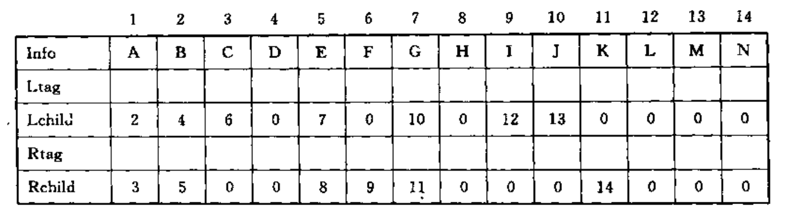
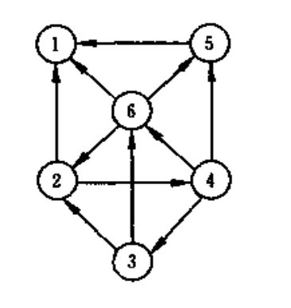
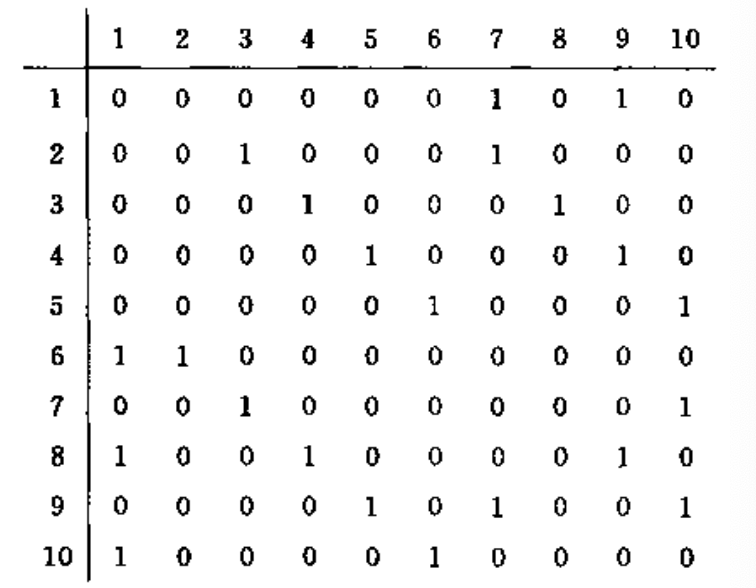
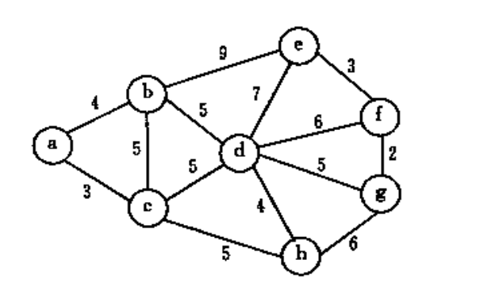
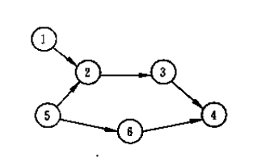
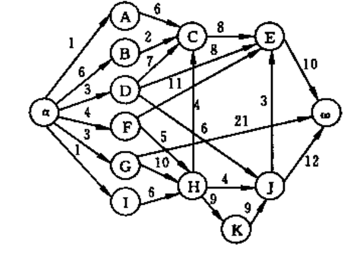
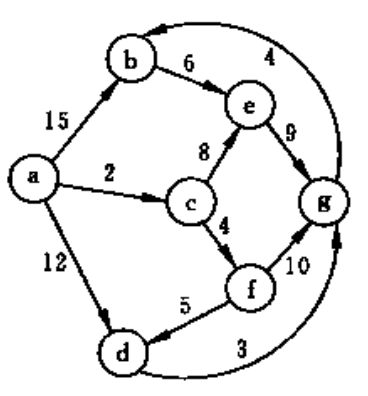
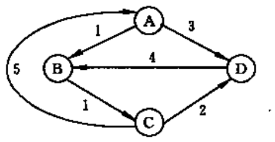

<!--
 * @Author: hiddenSharp429 z404878860@163.com
 * @Date: 2024-11-04 18:35:53
 * @LastEditors: hiddenSharp429 z404878860@163.com
 * @LastEditTime: 2024-11-17 00:09:01
-->
# DS

This is a course assignment repository for the Shantou University compulsory course "Data Structure"! Hope it can help you!

这是一个用于存放学校必修课程《数据结构》中课程作业的仓库，仅是个人思路，并且仅供参考，可用于学习交流，请勿用于其他用途。

This repository is divided into two parts: projects and assignments.

这个课程需要完成的任务分为项目和作业两个部分:

The following are the task descriptions for each assignment:

# Assignment
以下是各作业的要求以及存放答案的文件夹路径。

## Assignment 1
<details>

<summary>回答以下问题并且提交相关文件</summary>


1. 简述下列概念：数据、数据元素、数据项、数据对象、数据结构、逻辑结构、存储结构、抽象数据类型。
2. 以Niklus Wirth的观点，程序是什么? 
3. 算法有什么特性？
4. 好算法应满足哪些标准？
5. 数据结构主要在哪些层面上讨论问题？
6. 分析下列算法的时间复杂度。
```
(1)
for(i=0;i<n;i++)
    for(j=0;j<m;j++)
        a[i][j]=0;

(2)
s=0;
for(i＝0; i＜n;i++)
    for(j＝0;j<n;j++)
        s+＝B[i][j]
sum=s;

(3)
i=1；
while(i<=n)
i=i*3;

(4)x=0;
for(i＝1;i＜n;i++)
    for(j＝1;j<＝n-1;j++)      
        x++;
```
</details>

> 存放该作业文件夹：`assignment/assignment1`

## Assignment 2
<details>
<summary>完成以下任务并且提交相关文件。</summary>

1. 已知长度为n的线性表A采用顺序存储结构，请写一时间复杂度为O(n)、空间复杂度为O(1)的算法，该算法删除线性表中所有值为item的数据元素。
</details>

> 存放该作业文件夹：`assignment/assignment2`


## Assignment 3
<details>
<summary>完成以下任务并且提交相关文件。</summary>

1. 写一算法，对单链表实现就地逆置
2. 定义静态链表的存储结构；写出不带头结点静态链表的插入和删除算法。
3. 有一个双链表L，其中有n(n>=1)个值不相同的数据节点，设计一个算法删除最大值的结点。
</details>

> 存放该作业文件夹：`assignment/assignment3`


## Assignment 4
<details>
<summary>完成以下任务并且提交相关文件。</summary>

1. 
   1. 写出运行下列程序段的输出结果(元素类型为char)
    ```
    void main() {
        Stack S; 
        char x,y; 
        InitStack(S); // 初始化栈
        x= ‘e ‘; 
        y= ‘c’; 
        Push(S, ‘h‘); 
        Push(S, ‘r‘);  
        Push(S,y);
        Pop(S,x); 
        Push(S, x); 
        Pop(S,x); 
        Push(S,’a’); 
        While (!SEmpty(S)) {
            Pop(S,y); 
            printf(y); 
        }; 
        printf(x); 
    }
    ```
   2. 如果想要输出的结果是： c h a r ，怎么改这段程序？
2. 写出运行下列程序段的输出结果(元素类型为char)
```
void main() {
    Queue S; 
    char x,y; 
    InitQueue(S); // 初始化栈
    x= ‘e ‘; 
    y= ‘c’; 
    EnQueue(S, ‘h‘); EnQueue(S, ‘r‘); EnQueue(S,y);
    DeQueue(S,x); EnQueue(S, x); 
    DeQueue(S,x); EnQueue(S,’a’); 
    While (!SEmpty(S)) {
        DeQueue(S,y); printf(y); 
    }; 
    printf(x); 
}
```
- 3、算法设计：假设以带头结点的循环链表表示队列，并且只设一个指针指向队尾元素结点(注意不设头指针) ，试编写相应的置空队、判队空 、入队和出队等算法。
- 4、回文是指正读反读均相同的字符序列，如“abba”和“abdba”均是回文，但“good”不是回文。试写一个算法判定给定的字符向量是否为回文。(提示：将一半字符入栈)
</details>

> 存放该作业文件夹：`assignment/assignment4`

## Assignment 5
<details>
<summary>完成以下任务并且提交相关文件。</summary>

1. 自学第四章，以思维导图的形式总结第四章的内容。
</details>

> 存放该作业文件夹：`assignment/assignment5`

## Assignment 6
<details>
<summary>完成以下任务并且提交相关文件。</summary>

1. 设计一个算法,将含有n个元素的整数数组A[0…n-1]的元素循环右移1≤m<n)位。要求算法的空间复杂度为O(1)。
2. 完成用十字链表存储的稀疏矩阵的加法运算。
</details>

> 存放该作业文件夹：`assignment/assignment6`

## Assignment7
<details>
<summary>完成以下任务并且提交相关文件。</summary>

1. 知一棵树边的集合为{<I,M>,<I,N>,<E,I>,<B,E>,<B,D>,<A,B>,<G,J>, <G,K>,<C,G>,<C,F>,<H,L>,<C,H>,<A,C>},请画出这棵树，并回答下列问题：
   1. 哪个是根结点？
   2. 哪些是叶子结点？
   3. 哪个是结点G的双亲？
   4. 哪些是结点G的祖先？
   5. 哪些是结点G的孩子？
   6. 哪些是结点E的子孙？
   7. 哪些是结点E的兄弟？哪些是结点F的兄弟？
   8. 结点B和N的层次号分别是什么？
   9. 树的深度是多少？
   10. 以结点C为根的子树的深度是多少？
2. 一棵度为2的树与一棵二叉树有何区别？
3. 已知一棵度为k的树中有n1个度为1的结点，n2个度为2的结点，…，nk个度为k的结点，问该树中有多少个叶子结点？
4. 已知一棵含有n个结点的树中，只有度为k的分支结点和度为0的叶子结点，求该树含有的叶子结点的数目
5. 证明：一棵满k叉树上的叶子结点数n0和非叶子结点数n1之间满足下列关系：$n0=（k-1）n1+1$
</details>

> 存放该作业文件夹：`assignment/assignment7`

## Assignment 8
<details>
<summary>完成以下任务并且提交相关文件。</summary>

1. 用按层次顺序遍历二叉树的方法，统计树中具有度为1的结点数目。
2. 求任意二叉树中第一条最长的路径长度，并输出此路径上各结点的值。
3. 输出二叉树中从每个叶子结点到根结点的路径。
4. 讲下列二叉链表改为先序线索链表（不用画树）



</details>

> 存放该作业文件夹：`assignment/assignment8`

## Assignment 9
<details>
<summary>完成以下任务并且提交相关文件。</summary>

1. 设一棵二叉树的先序序列： A B D F C E G H ，中序序列： B F D A G E H C
   1. 画出这棵二叉树。
   2. 画出这棵二叉树的后序线索树。
   3. 将这棵二叉树转换成对应的树（或森林）
2. 假设一棵非空树采用孩子链存储结构,每个结点值均为单个字符,完成以下任务：
   1. 设计一个算法求树t中的叶子结点个数。
   2. 设计一个算法求树t中度为k的结点个数。
3. 设用于通讯的电文由八个字母组成, 字母在电文中出现的频率分别为: 8, 10, 5, 19, 30, 15, 11, 28。试为这八个字母设计哈夫曼编码。   
</details>

> 存放该作业文件夹：`assignment/assignment9`

## Assignment 10
<details>
<summary>完成以下任务并且提交相关文件。</summary>

1. 假设不带权有向图G采用邻接表存储,分别设计实现求解以下问题的算法。
   1. 求出图G中每个顶点的入度。
   2. 求出图G中每个顶点的出度。
   3. 求出图G中出度最大的一个顶点,输出该顶点编号。
   4. 计算图G中出度为0的顶点数。
   5. 判断图G中是否存在边<i,j>。
2. 分别以邻接矩阵和邻接表作为存储结构，实现以下图的基本操作：
   1. 增加一个新顶点v，InsertVex(G, v)；
   2. 删除顶点v及其相关的边，DeleteVex(G, v);
   3. 增加一条边<v，w>，InsertArc(G, v, w);
   4. 删除一条边<v，w>，DeleteArc(G, v, w)。
3. 已知如右图所示的有向图，请给出该图的
   1. 每个顶点的入/出度；
   2. 邻接矩阵；
   3. 邻接表；
   4. 逆邻接表；
   5. 强连通分量
   
   
</details>

> 存放该作业文件夹：`assignment/assignment10`

## Assignment 11
<details>
<summary>完成以下任务并且提交相关文件。</summary>

1. 已知二维数组表示的图的邻接矩阵如下图所示，分别画出自顶点1出发进行遍历所得的深度优先生成树和广度优先生成树。


2. 设计一个算法,判断一个未知顶点个数和边数的无向连通图G是否是棵树,假设图采用邻接表存储。若是树,返回true;否则返回 false.（提示：一个无向连通图G是一棵树的条件是G中无回路或者恰好有n-1条边，可采用后者作为判断条件）
(用图1和图2验证作业题2算法的正确性)


</details>

> 存放该作业文件夹：`assignment/assignment11`

## Assignment 12
<details>
<summary>完成以下任务并且提交相关文件。</summary>

1. 针对下图，
   1. 写出其邻接矩阵，并按Prim算法求其最小生成树
   2. 写出其邻接表，并按Kruskal算法求其最小生成树


2. 针对下图，
   1. 列出全部可能的拓扑有序序列
   2. 写出其邻接表， 并指出应用课上所学的TopLogicalSort算法求得的是哪一个序列


</details>

> 存放该作业文件夹：`assignment/assignment12`

## Assignment 13
<details>
<summary>完成以下任务并且提交相关文件。</summary>

1. 针对下图AOE网络，计算个活动弧的e（ai），l（ai）的值、各事件（顶点）的ve（vi），l（vi）
   


2. 利用Dijkstra算法，求图中顶点a到其他各顶点的最短路径，写出执行算法过程中各步的状态



3. 利用Floyd算法，求图中各对顶点间的最短路径



4. 已知一个有序表的表长为8N，并且表中没有关键字相同的记录。假设按如下所述方法查找一个关键字等于给定值K的记录：先在第8,16,24,…,8K,…,8N个记录中进行顺序查找，或者查找成功，或者由此确定出一个继续进行折半查找的范围。画出描述上述查找过程的判定树，并求等概率查找时查找成功的平均查找长度。
</details>

> 存放该作业文件夹：`assignment/assignment13`

## Assignment 14
<details>
<summary>完成以下任务并且提交相关文件。</summary>

1. 请对长度为10 的表: (22,45,56,12,33,57,88,94,44,11)画出构造平衡二叉树的过程。
2. 假设一棵平衡二叉树的每个结点都标明了平衡因子b，设计一个算法，求平衡二叉树的高度。
3. 设哈希函数H（K）=3 K mod 11，哈希地址空间为0～10，对关键字序列（32，13，49，24，38，21，4，12），按下述两种解决冲突的方法构造哈希表，并分别求出等概率下查找成功时和查找失败时的平均查找长度ASLsucc和ASLunsucc。
   1. 线性探测法；
   2. 链地址法。
</details>

> 存放该作业文件夹：`assignment/assignment14`

## Assignment 15
<details>
<summary>完成以下任务并且提交相关文件。</summary>

1. 以关键码序列(503,087,512,061,908,170,897,275,653,426)为例，手工执行以下排序算法，写出每一趟排序结束时的关键码状态:
   1. 直接插入排序；
   2. 希尔排序(增量d[1]=5)；
   3. 快速排序；
   4. 堆排序
2. 算法设计：
   有n个记录存储在带头结点的双向链表中，现用双向冒泡排序法对其按上升序进行排序，请写出这种排序的算法。（注：双向冒泡排序即相邻两趟排序向相反方向冒泡）。
3. 判断以下序列是否是最小堆？如果不是，将它调整为最小堆。
   1. {100,86,48,73,35,39,42,57,66,21}
   2. {12,70,33,65,24,56,48,92,86,33}
</details>

> 存放该作业文件夹：`assignment/assignment15`
